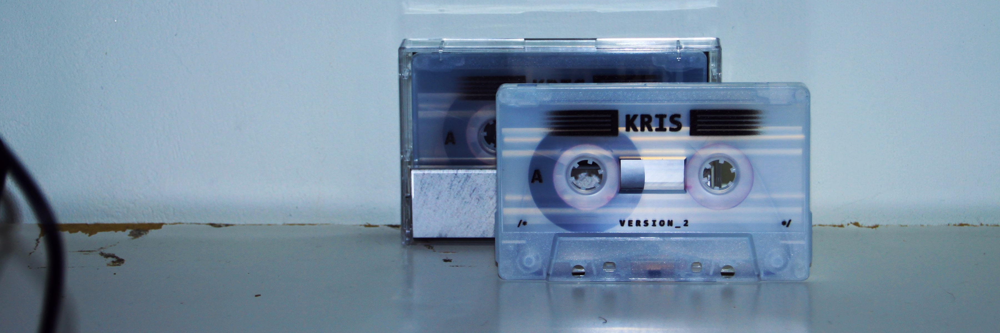

# Music

I play bass guitar, produce music and can play synthesizers. I make and listen to pop which incorporates elements of electronica, industrial rock and "singer songwriter". Some artists i value highly are Aphex Twin, Radiohead, Sufjan Stevens and Burial.
On this page i present (in reverse quasi-chronological order) my music career, accomponied by small stories explaining the context of those moments.

For my full discography, go to this [link](./discography).  
[Here](./live) you can find places i have played live.

## Droomboter

 

## Felicitas

Near the end of my studies at the conservatory me and Rebecca Kreyenberg started working together more. Although we lived different lives, the way we looked at pop music and our sound in pop music made for a good combination. 

 

## kris

kris is my personal project, one where i am completetly responsible for everything. It mainly started as one to graduate the conservatory with. It also the main place i have tried exploring what i want to say (in music). This resulted in the following two products, a cassette which contains two EP's ([1](https://open.spotify.com/album/10r3CJ15hJj9tp4ye4MtOQ?si=eKITRrIJSEmgBqlzk8p6AA), [2](https://open.spotify.com/album/7j3qvfhx7C26vrOl93txpm?si=vAkTWGNjRSOQVrVLWBBF5w)) and a live show which is watchable [here](https://youtu.be/Yxc8Xeb0tRg) (highly recommended! A short version can be found [here](https://youtu.be/4SBD5OVc_ZQ)). During my time at the conservatory i have mostly (and still do) struggled with what music i want to make / what story i want to tell. Looking back at the live show i'm impressed that i have been able to make such a big project, incorporting visuals, lights, text and real instruments into my practice. However i can't shake the feeling that although i do display some of the artistic core which i want to be, its depth is still lacking.

 

## Lief Dagboek

During middle school i also had numerous bands with me friends where we played both original songs as well as rock covers. I was also making (some awful) electronic dance music in my bedroom. After middle school I had applied to study at the conservatory and was accepted. During the first year i was having fun and playing a lot of music, but i did not have a band / main project yet. At the end of the first year a third year student (Luc Laport) asked me to be in his band as bass guitarist (which i found really cool as i was not a big social butterfly). In this band we played industrial rock music with weird meters. This was also the first big album i had produced thus far. We would play quite some gigs and in this band i also explored what it means to be on stage and to be a performer (not that i was/am that confident in the performer part still). The band sadly did not survive (due to a loss of interest) the covid epidemic.

<iframe data-testid="embed-iframe" style="border-radius:12px" src="https://open.spotify.com/embed/album/2NHZw76mVfxs74ZLiQ8e8M?utm_source=generator" width="100%" height="152" frameBorder="0" allowfullscreen="" allow="autoplay; clipboard-write; encrypted-media; fullscreen; picture-in-picture" loading="lazy"></iframe>

 

## Laurens Collee

From a young age i had music lessons. Around my 13th year I was also interested in electronic music, recording and live audio. 
Gerjan van der Giessen taught me from a young age about live audio and eventually gave me the trust to be the sound engineer for [UitDeLoods](https://www.youtube.com/watch?v=wxmOK_ZM7hI) livestreams (for which i am really grateful). Laurens was a friend from Gerjan and my parents, and we had also played together often in the church band. 
We started recording his EP in the same room as we made the UitDeLoods stream. And this would become the first EP i have produced. 

<iframe data-testid="embed-iframe" style="border-radius:12px" src="https://open.spotify.com/embed/album/1TWUiosuq5qKBI5wgMsrif?utm_source=generator" width="100%" height="152" frameBorder="0" allowfullscreen="" allow="autoplay; clipboard-write; encrypted-media; fullscreen; picture-in-picture" loading="lazy"></iframe>

 
